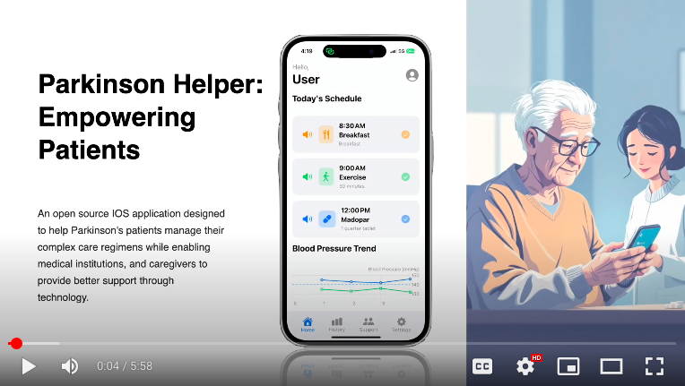

# Parkinson Helper: Empowering Patients

This open-source iOS (Swift/SwiftUI) application was born from a family member's journey with the condition, which is the driving force behind the mission to provide a simple, accessible, and helpful tool. The project is now being open-sourced to invite collaboration from developers who share this vision.

## Current Status: A Functional MVP

This application is currently a **Minimum Viable Product (MVP)**. It provides a basic foundation with features for medication scheduling, task management, and blood pressure monitoring. While the core functionality is in place and delivers real-world value, more work is needed to add features, enhance stability, improve data management, and expand its reach. We welcome community contributions to help build upon this foundation.

## Guiding Principles: Security, Privacy, and Best Practices

This project is committed to the highest standards of patient care and privacy. All contributors are expected to adhere to these principles.

*   **Privacy by Design:** All user-generated health data is stored exclusively on-device using Core Data. No personal or health information is ever transmitted to an external server. User privacy is paramount.  Should a user willingly choose to share data with a healthcare professional, all personally identifiable information will be obfuscated to ensure privacy.
*   **Secure Coding:** Follow secure coding practices at all times. Do not log sensitive data, and handle all user information with care.
*   **Apple's Best Practices:** Development should align with Apple's official guidelines, including the Human Interface Guidelines (HIG) for an intuitive user experience and the App Store Guidelines to meet standards for safety and quality.

## Vision

With studies indicating that over ~11 million people worldwide were living with Parkinson's disease, the need for accessible support tools is immense. Our goal is to create the most effective, free, and open-source companion app for the Parkinson's community. By leveraging the power of community-driven development, we aim to build a comprehensive, user-friendly, and reliable tool that adapts to the real-world needs of its users. We believe that by working together, we can create something truly impactful.

## Key Features

*   **Dynamic Medication Scheduling:** Manage complex, multi-phase medication profiles with ease. The schedule is dynamically generated based on a user-defined start date.
*   **Smart Task Management:** A clear, daily checklist of medication and health-related tasks.
*   **Adaptive UI:** The app's layout, particularly for task rows, adapts to various accessibility font sizes, preventing text truncation and ensuring a consistent user experience.
*   **Daily Rollover:** Incomplete tasks from the previous day are automatically marked as "missed" and a fresh schedule is loaded for the new day, ensuring data accuracy.
*   **Blood Pressure Monitoring:** A dedicated module to capture and visualize sitting and standing blood pressure readings. Includes an automated 3-minute timer between measurements and a graph to plot trends from SYS/DIA inputs.
*   **Historical Data:** All completed and missed tasks are saved to a persistent history view, allowing users and caregivers to track adherence and trends.
*   **Robust Data Handling:** Core Data fetching is handled safely using `guard let` and `if let` to prevent crashes from unexpectedly nil values.
*   **Global Localization:** Built to be translated into any language, with all user-facing text sourced from localization files (`.strings`).
*   **Text-to-Speech Accessibility:** Speak task details aloud to improve accessibility.
*   **Properly Licensed:** The project includes a `LICENSE` file with the full text of the MIT License, making it truly open source.

## Technology Stack

*   **UI:** SwiftUI
*   **Data Persistence:** Core Data
*   **Notifications:** UserNotifications
*   **Onboard AI/LLM:** Foundation
*   **Text-to-Speech:** AVFoundation

## Parkinson Helper's High Level Specifications

State | Core Task | High Level Specifications.
--- | --- | ---
[X] | UI DESIGN | Adaptive Card Based Interface with Menu Tabs for different functions.
[X] | UI DESIGN | User Profile button with Family name, Optional name, Age (mandatory), Gender M/F
[X] | UI DESIGN | Main Menu Buttons (Profile, Home, History, Support, Settings)
[X] | UI DESIGN | Today’s Schedule cards with current task due, with check off function.
[X] | UI DESIGN | Daily Task (Meds/ Exercise/BP) with representing SF Icon, Text, TTS support.
[X] | UI DESIGN | Blood Pressure monitor card with SYS/DIA Plot Graph.
[X] | UI DESIGN | History Tab showing all historically completed / incomplete task sort by date.
[X] | UI DESIGN | Support Tab placeholder for future exercise, meditation, health advisories.
[X] | UI DESIGN | Settings Tab download medication profiles and schedule plan.
[ ] | DB DESIGN | Storing Current Medication profile in DB.
[X] | DB DESIGN | Deploying Core Data db to store Historical task.
[X] | DB DESIGN | Deploying Core Data db to store Blood Pressure task.
[ ] | DB DESIGN | Deploying Core Data db to store downloaded Medication profiles in the future.
[ ] | DB DESIGN | Deploying Core Data db to store AI summarized monthly report.
[X] | SYS DESIGN | Function to display daily task dynamically.
[X] | SYS DESIGN | Function to display daily BP graph plot dynamically.
[X] | SYS DESIGN | Function to capture user daily sitting, waiting, standing BP.
[X] | SYS DESIGN | Function to Dispatch Alerts to user at task time.
[X] | SYS DESIGN | Function to perform daily roll over of incomplete task to history tab.
[X] | SYS DESIGN | Function to perform daily refresh of daily task for new day.
[X] | SYS DESIGN | Function to Convert displayed text to speech.
[ ] | SYS DESIGN | Function to utilize phone’s onboard computer vision to read BP display.
[ ] | SYS DESIGN | Function to utilize phone’s onboard AI models to summarize BP and task data.
[ ] | SYS DESIGN | Expand language localization beyond current language support.
[ ] | SYS DESIGN | Extend support to other phone operating systems.
[ ] | SYS DESIGN | Connectivity for user to download new medication profiles.
[ ] | SYS DESIGN | Function to pre-scan and validate downloaded medication profiles for schema compliance.

## Project Roadmap

This section serves as the single source of truth for planned enhancements and tasks.

### High Priority
*   [ ] **Improve Error Handling:** Replace `fatalError()` calls (e.g., in `Persistence.swift`) with non-crashing error handling that alerts the user.
*   [ ] **Create Issue Templates:** Set up GitHub templates for bug reports and feature requests to streamline contributions.

### Future Tasks
*   [ ] **Code Cleanup:** Remove commented-out test code and debugging `print()` statements.
*   [ ] **On-Device OCR:** Implement a function to utilize the phone’s onboard computer vision to read blood pressure monitor segment displays.
*   [ ] **On-Device AI Summaries:** Implement a function to use onboard AI models to summarize blood pressure and task adherence data.
*   [ ] **Expand Localization:** Add more languages beyond the current set.
*   [ ] **Cross-Platform Support:** Extend support to other mobile operating systems.

## Open Architectural Issues

This section documents larger, foundational challenges and proposed solutions that require significant architectural work.

---

### **Medication Profile Architecture Upgrade**

#### **1. The Problem: Lack of Scalability**

The current system for generating medication schedules is not scalable. It relies on a single, hardcoded function (`MedicationData.createLowDosageMadopar`) to create a static "Low Dosage" profile. This makes it impossible to add new profiles (e.g., "Normal Dosage," "Intense Dosage") or allow for user customization without changing the application's code.

#### **2. The Proposed Solution: Database-Driven Profiles**

The recommended solution is to make the medication profiles dynamic by storing them in the Core Data database. This is a significant but necessary architectural upgrade for future flexibility.

#### **3. Key Components of the Change**

*   **Core Data Model Changes**
    *   New entities will be created: `ProfileEntity` (for the name), `PhaseEntity` (for date ranges), and `TaskTemplateEntity` (for recurring task details).
*   **Application & Logic Changes**
    *   **ScheduleManager Overhaul**: Refactor `ScheduleManager` to fetch the selected profile from Core Data instead of using the hardcoded function.
    *   **Data Seeding**: Create a one-time process to populate the database with default profiles.
*   **User Interface (UI) Changes**
    *   The entry point will be the existing **ProfileView** (Settings tab).
    *   **Profile Selection**: The `MedicationProfileView` will be modified to include a dropdown (`Picker`) to select from available profiles.
    *   **Profile Management**: New views will be built to allow users to **create, edit, and delete** profiles.

#### **4. Summary of Impact**

This is a foundational change touching the data, logic, and UI layers. While it is a multi-day development effort, it will result in a flexible, scalable, and professional system.

---

## The Road Ahead: Future Architecture & Challenges

Our vision extends far beyond the current application. We are looking at significant architectural evolutions to make the app more powerful and accessible, while navigating important challenges.

1.  **Professional Profile Ecosystem:**
    *   **The Vision:** We envision a system where healthcare practitioners can create and manage standardized medication, exercise, and daily activity profiles. Patients and caregivers could then securely download these pre-configured profiles directly into the app, simplifying setup and ensuring accuracy.
    *   **The Core Challenge:** How do we build this client-server architecture while upholding our core principle of user privacy? A key design challenge will be allowing for the secure and anonymous download of profiles while ensuring all personal patient data remains strictly on-device.

2.  **Cross-Platform Reach:**
    *   To reach the largest possible audience, we must expand to other mobile operating systems, including Android and HarmonyOS. This will require a strategic approach to code sharing and native development.

3.  **On-Device AI:**
    *   As hardware and technology evolves, we plan to leverage on-device Large Language Models (LLMs) for powerful, privacy-preserving summarization features, such as generating insights on blood pressure trends or medication adherence rates.

## How to Contribute

We welcome developers of all levels. Whether you're fixing a bug, adding a new feature, or improving localization, your input is valuable.

*   **Add a New Language:** Help us make the app accessible to everyone.
*   **Tackle a Future Challenge:** Are you an expert in backend development, data privacy, or Android development? Help us design and build the next generation of this platform.
*   **UI/UX Enhancements:** Polish the user interface and improve the user experience.
*   **Bug Hunting:** Help us find and fix bugs to improve stability.

## Getting Started

1.  Clone the repository.
2.  Open `ParkinsonHelper.xcodeproj` in Xcode.
3.  Build and run the project on the simulator or a physical device (ie. Iphone). 

## Project Files
s/n | filename | Description
---|---|---
0 | ParkinsonHelper.xcodeproj | Xcode project file for Parkinson Helper.
1 | Assets.xcassets | A folder that stores all the visual assets for the app, such as icons and images.
2 | BPmonitor.xcdatamodeld | A Core Data model file that defines the structure for storing blood pressure monitoring data.
3 | en.lproj | Folder containing language-specific resources for English to support app localization.
4 | ms.lproj | Folder containing language-specific resources for Malay to support app localization.
5 | ta.lproj | Folder containing language-specific resources for Tamil to support app localization.
6 | zh-Hans.lproj | Folder containing language-specific resources for Simplified Chinese to support app localization.
7 | ParkinsonHelper.xcdatamodeld | The main Core Data model file that defines the data structures for the Parkinson's Helper app.
8 | .DS_Store | A macOS system file that stores custom attributes of its containing folder.
9 | AlertChime.mp3 | An audio file used to play a sound for alerts and notifications within the app.
10 | BloodPressureView.swift | A SwiftUI view that displays blood pressure trends in a chart.
11 | BloodPressureViewModel.swift | The view model for `BloodPressureView`, responsible for fetching and processing blood pressure data.
12 | BottomNavBar.swift | A SwiftUI view that creates the main navigation bar at the bottom of the screen.
13 | BPEntryView.swift | A SwiftUI view that provides a user interface for entering blood pressure readings.
14 | ContentView.swift | A SwiftUI view that acts as the initial view, deciding whether to show the main app interface or the language selection screen.
15 | DataModels.swift | Contains the core data models for the application, such as `ScheduledEvent`, `SchedulePhase`, and `MedicationProfile`.
16 | HeaderView.swift | A SwiftUI view that displays a greeting to the user and provides a button to access their profile.
17 | HistoryView.swift | A SwiftUI view that shows a historical log of all completed and missed tasks.
18 | LanguageControllerView.swift | A SwiftUI view that manages the app's language settings and displays a splash screen.
19 | LanguageSelectionView.swift | A SwiftUI view that allows the user to select their preferred language.
20 | MainView.swift | The main container view of the app, which orchestrates the display of different screens.
21 | MedicationData.swift | A file that contains predefined medication schedules and dosage information.
22 | MedicationProfileView.swift | A SwiftUI view that displays the details of the user's medication schedule.
23 | ParkinsonHelperApp.swift | The main entry point of the application.
24 | Persistence.swift | Manages the Core Data stack for the application.
25 | ProfileView.swift | A SwiftUI view that allows the user to edit their personal profile information.
26 | ScheduleManager.swift | A class that manages the user's daily schedule, including loading tasks and scheduling notifications.
27 | ScheduleView.swift | A SwiftUI view that displays the user's upcoming tasks for the day.
28 | SpeechSynthesizerManager.swift | A manager class that handles text-to-speech functionality.
29 | SupportView.swift | A SwiftUI view that provides supportive and motivational information to the user.
30 | UIState.swift | A class that holds global UI state for the application.
31 | UserProfile.swift | A data model that defines the structure for a user's profile information.
32 | Launch Screen.storyboard | A file that defines the user interface for the launch screen, which is displayed when the application starts up.
33 | ParkinsonHelper.xcodeproj | The main Xcode project file. It contains all the settings for the project, including the file structure, build targets, and code signing configurations.
34 | README.md | A Markdown file that provides a general overview of the project, its purpose, and instructions on how to use it.
35 | LICENSE.md | A Markdown file that provides the open source license for this project.
36 | CONTRIBUTING.md | A Markdown file that provides a general overview of the project contribution details.
37 | CODE_OF_CONDUCT.md | A Markdown file that provides a breakdown on the Contributor Covenant Code of Conduct

## License

This project is licensed under the MIT License - see the `LICENSE` file for details.
